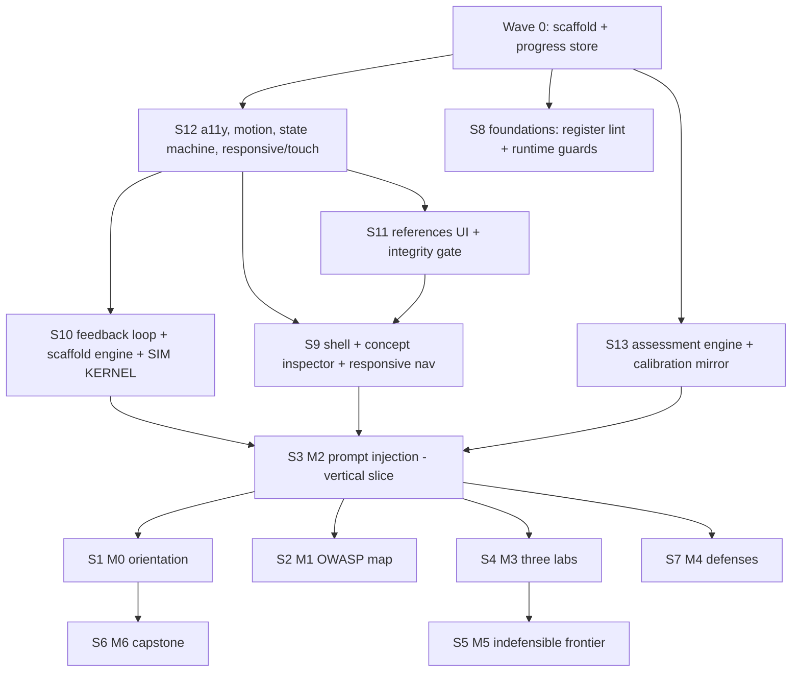

# Story Implementation Plan — sequencing, parallel tracks, and execution rules

*Compiled 2026-08-28. Derives the build order for the 13 Ceetrix stories in epic `llm-sec-tutorial` from the dependency graph in their designs, identifies which tracks can run concurrently under subagents, and records the execution rules (one story Done at a time, push after each).*

---

## 1. Dependency graph

**Hard edges (why):**
- Everything needs **Wave 0** (Vite/Bun/React scaffold + shared progress store).
- **S12 first**: it owns the seven-state machine, breakpoints, and touch primitives that every other UI consumes.
- **S10 owns `src/sim/kernel.ts`** (per S1's design note "shared kernel, owned by the feedback-engine story"). Every attack lab composes it, so S10 precedes all modules.
- **S9 (shell)** hosts modules and embeds the reference surface, so it follows S11 and S12.
- **S13 (assessment)** supplies rubric grading used by every module mastery gate.
- **S3 (M2) is the vertical slice** (plan Part C, Milestone 3): it proves kernel → viz → content → a11y end to end before the remaining modules copy the pattern.
- **S7 (M4) replays S3's exploit**; **S6 (M6) reruns S1's EchoLeak incident** — real content dependencies, not just ordering preference.

---

## 2. Wave schedule and parallel tracks

| Wave | Stories | Can run concurrently? | Rationale |
|---|---|---|---|
| **0** | *(scaffold — not a story)* | — | Bun+Vite+React+TS, Vitest, Playwright, design tokens, shared progress store |
| **1** | **S12**, **S8** | ✅ Two agents | Disjoint paths: `src/a11y/`+`src/responsive/`+`src/engine/stateMachine.ts` vs `src/foundations/`+`ci/` |
| **2** | **S10**, **S11**, **S13** | ✅ Three agents | Disjoint: `src/engine/`+`src/sim/` vs `src/references/` vs `src/assessment/` |
| **3** | **S9** | Single | Integrates S11 + S12 into the shell |
| **4** | **S3** (vertical slice) | Single | Deliberately serial — validates the whole stack before replication |
| **5** | **S1**, **S2**, **S4** | ✅ Three agents | Disjoint module dirs `src/modules/m0|m1|m3`, all depend only on platform + S3's proven pattern |
| **6** | **S7**, **S5** | ✅ Two agents | `src/modules/m4` (needs S3) and `src/modules/m5` |
| **7** | **S6** | Single | Capstone; reuses M0 incident and every prior concept |

**Subagent safety rule:** concurrent agents may only write inside their story's own directories (listed in that story's design "Planned files"). Shared files (`src/state/progress.ts`, `src/sim/kernel.ts`, router, design tokens) are written **only** by the owning story's wave, never concurrently.

---

## 3. Ceetrix ordering

Story `priority` is set to the execution index so the backlog reads in build order:

| Priority | Story | Wave |
|---|---|---|
| 1 | S12 any-device interface | 1 |
| 2 | S8 foundations | 1 |
| 3 | S10 feedback engine + kernel | 2 |
| 4 | S11 references | 2 |
| 5 | S13 assessment | 2 |
| 6 | S9 shell | 3 |
| 7 | S3 M2 prompt injection | 4 |
| 8 | S1 M0 orientation | 5 |
| 9 | S2 M1 OWASP map | 5 |
| 10 | S4 M3 three labs | 5 |
| 11 | S7 M4 defenses | 6 |
| 12 | S5 M5 indefensible frontier | 6 |
| 13 | S6 M6 capstone | 7 |

---

## 4. Execution rules (per the standing instruction)

1. **One story at a time to Done.** Do not start story *n+1* until story *n* passes all Ceetrix gates and is `done`. This forces the spec chain to stay honest.
2. **Per task:** implement → run its tests → `task(action='complete')` with real `evidence` (files changed + rationale), `test_results` (passed/failed counts), and `feedback.test_summary`.
3. **Per story:** run `coverage(check)` → expect G1/G2/G3/G8/G9/G11/G12 green and G6 green once tasks are done → `story(action='update', status='done')`.
4. **Push after each story** — one commit per story, message references the story id, then `git push origin main`.
5. **Never fabricate evidence.** If a test fails, fix it or record the failure honestly; a red test is never reported as passing.

---

## 5. Resolved ownership gaps (found during sequencing)

Two shared artifacts were referenced by designs but owned by no capability. Resolved here so nothing is built twice or not at all:

| Artifact | Referenced by | Resolution |
|---|---|---|
| `src/state/progress.ts` (shared progress store) | S1, S9, S13 designs (as "shared") | Built in **Wave 0 scaffold** as infrastructure; S9 owns its *save/resume* behaviour (`x2d.responsive_nav`). |
| `src/sim/kernel.ts` (shared simulation kernel) | S1 design names it "owned by the feedback-engine story" | Built in **S10** alongside `x3d.feedback_loop`; all labs consume it. |

---

## 6. Definition of done for the whole run

- All 13 stories `done` in Ceetrix with gates green.
- `bun run build` succeeds; `bun test` green; Playwright e2e green.
- App runs locally under Miniflare and is deployable to Cloudflare Pages as a static bundle.
- Every module's functionality matches its design contracts (attack sims real, mastery gates enforcing, references openable, mobile layout working).
